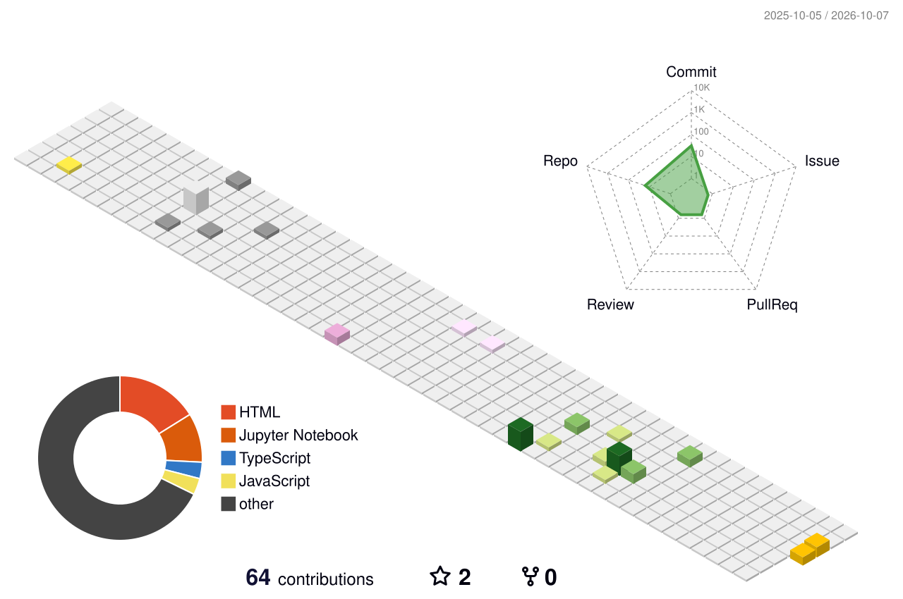

<p align="center">

</p>

<p align="center">

</p>

<p align="center">
<a href="https://github.com/ruthishkumar18"></a>
<a href="https://www.linkedin.com/in/ruthishkumar18/"></a>
<a href="mailto:ruthishkumar.rk@gmail.com"></a>
<a href="https://portfolio-ten-liard-71.vercel.app/"></a>
</p>

<p align="center">


</p>

---

## 👋 About Me

<table>
<tr>
<td width="62%" valign="top">

### Hi, I'm Ruthishkumar G

I am an **Integrated M.Tech Computer Science and Engineering student** at **Sri Ramakrishna Engineering College, Coimbatore**, focused on building practical software and AI systems.

My interests include:

- 🤖 Artificial Intelligence and Machine Learning
- 👁️ Computer Vision and Deep Learning
- 🌐 Full Stack Web Development
- 📱 Application Development
- ⚙️ Industrial automation and real-time systems
- 🧠 AI-powered solutions for real-world problems

I enjoy taking an idea from **problem → system design → development → deployment**.

Currently, I am working as an **intern at Sieger Spintech Equipment Private Limited, Coimbatore**, working on software and industrial technology projects.

</td>
<td width="38%" align="center">

<br/><br/>


</td>
</tr>
</table>

---

## 🧑‍💻 Current Focus

```text
AI / ML                 ████████████████████  Computer Vision
Full Stack Development  ██████████████████░░  Web Applications
Industrial Systems      ████████████████░░░░  Automation & Data
Cloud & Deployment      ██████████████░░░░░░  Production Systems
```

- 🌿 **PlantSpeakAI** , AI-enabled plant electrophysiology monitoring
- 🔩 **Industrial Computer Vision** , automated inspection and defect detection
- 🏭 **Industrial Data Systems** , PLC data and machine-management workflows
- 📋 **Attendance & Management Systems** , real-time web applications
- 🚀 **AI-powered full-stack applications** with production deployment

---

# 📊 GitHub Analytics

<p align="center">


</p>

<p align="center">

</p>

<p align="center">

</p>

> The analytics cards are generated from the GitHub account and update automatically as GitHub activity changes.

---

# 🧊 3D Contribution Universe

<p align="center">

</p>

<p align="center"><i>A 3D visualization of my GitHub contribution activity.</i></p>

> **3D setup:** this image is generated by a GitHub Action and stored in `profile-3d-contrib/`. Add the `github-profile-3d-contrib` workflow to this profile repository and run it once. The action can generate animated 3D contribution views and update them automatically.
>
> Reference: https://github.com/yoshi389111/github-profile-3d-contrib

---

# 🛠️ Technology Stack

### Languages
<p align="center">

</p>

### AI / Machine Learning / Computer Vision
<p align="center">

</p>

<p align="center">


</p>

### Full Stack Development
<p align="center">

</p>

### Databases / Cloud / Tools
<p align="center">

</p>

---

# 🚀 Featured Projects

<table>
<tr>
<td width="50%" valign="top">

## 🌿 PlantSpeakAI

**AI-enabled plant electrophysiology monitoring system**

Detects plant stress conditions using bioelectrical signals collected from plants.

**Technology:** `ESP32` `Ag/AgCl Electrodes` `Python` `Machine Learning` `Neural Networks` `Android`

**Focus:** Plant health monitoring, signal acquisition, AI classification and mobile visualization.

</td>
<td width="50%" valign="top">

## 🔩 Steel Surface Defect Detection

**Deep learning based industrial inspection**

A computer vision system for identifying surface defects in steel using object detection models.

**Technology:** `YOLO11` `OpenCV` `Python` `Roboflow` `Deep Learning`

**Focus:** Industrial quality inspection and automated visual defect detection.

</td>
</tr>

<tr>
<td width="50%" valign="top">

## 🔴 O-Ring Detection & Counting

**Industrial computer vision project**

Automated O-Ring detection and counting system developed for an industry collaboration project.

**Technology:** `YOLO` `OpenCV` `Python` `Flask` `HTML` `CSS` `JavaScript`

**Focus:** Industrial inspection, object detection, counting and production workflows.

</td>
<td width="50%" valign="top">

## 📋 Internship Management Portal

**Full-stack internship workflow platform**

A web platform for managing internship-related processes and student information.

**Technology:** `React` `Python` `Flask` `MySQL` `JavaScript`

**Focus:** Workflow automation, authentication, data management and deployment.

</td>
</tr>

<tr>
<td width="50%" valign="top">

## 🏭 PLC Data Management System

**Industrial automation data platform**

A web-based system for managing PLC-related machine data and industrial workflows.

**Technology:** `React` `Django` `Python` `SQL Server`

**Focus:** Industrial data management, machine information and real-time services.

</td>
<td width="50%" valign="top">

## 📊 Attendance Management System

**Real-time employee attendance platform**

A multi-company attendance system with administrators, supervisors and employees.

**Technology:** `Next.js` `Prisma` `PostgreSQL` `React`

**Focus:** Role-based access, company management, employee attendance and production deployment.

</td>
</tr>
</table>

---

# 💼 Experience

| Role | Organization | Period |
|---|---|---|
| **Software / Technology Intern** | **Sieger Spintech Equipment Private Limited, Coimbatore** | **June 2026 – December 2026** |
| **AI/ML Intern** | RGREEN Technologies, Madurai | **2025** |
| **Application / Web Development Internships** | Various industry projects | **2025** |

---

# 🎓 Education

### Sri Ramakrishna Engineering College, Coimbatore

**Integrated M.Tech, Computer Science and Engineering**

- 5-Year Integrated M.Tech CSE
- **CGPA: 7.76, till 6th Semester**
- Executive Member, Association of Master's Tech, CSE

### Higher Secondary Education

**Theni, Tamil Nadu**

---

# 🏆 Highlights

<p align="center">


</p>

---

# 🏆 GitHub Trophies

<p align="center">
<a href="https://github.com/ruthishkumar18">

</a>
</p>

---

# 🌐 Find Me Online

<p align="center">
<a href="https://ruthishkumar18.github.io"></a>
<a href="https://portfolio-ten-liard-71.vercel.app/"></a>
<a href="https://www.linkedin.com/in/ruthishkumar18/"></a>
<a href="mailto:ruthishkumar.rk@gmail.com"></a>
</p>

---

<p align="center">

</p>

<p align="center">

</p>

<p align="center"><sub>© 2026 Ruthishkumar G · Built with Markdown, GitHub Actions and dynamic GitHub visualizations.</sub></p>
